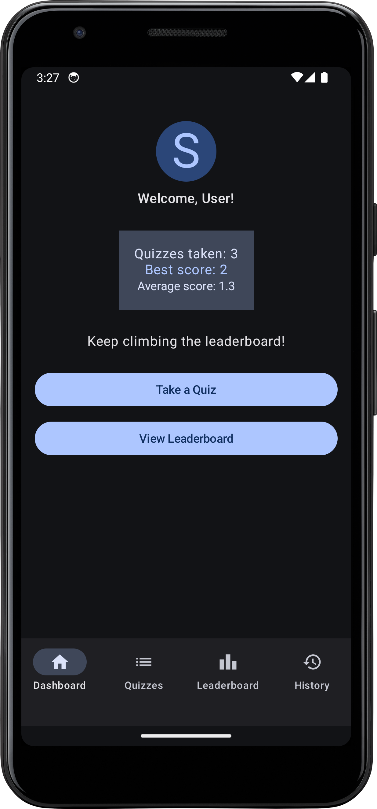
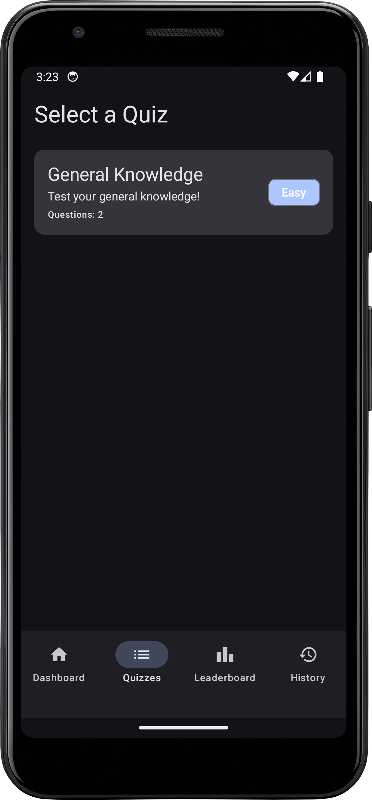
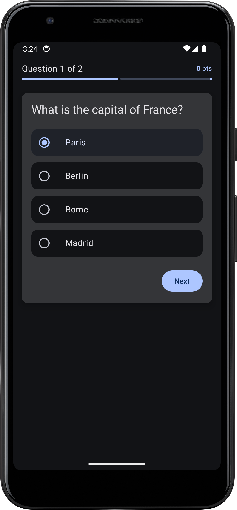
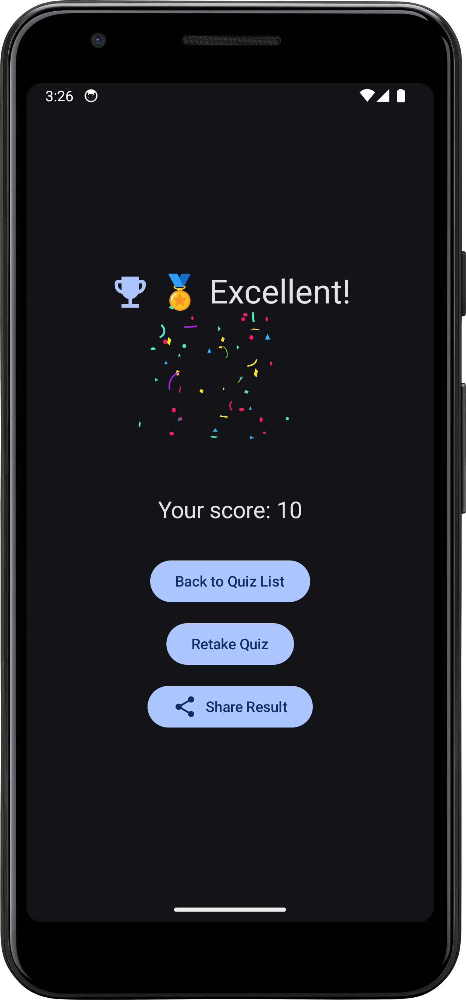
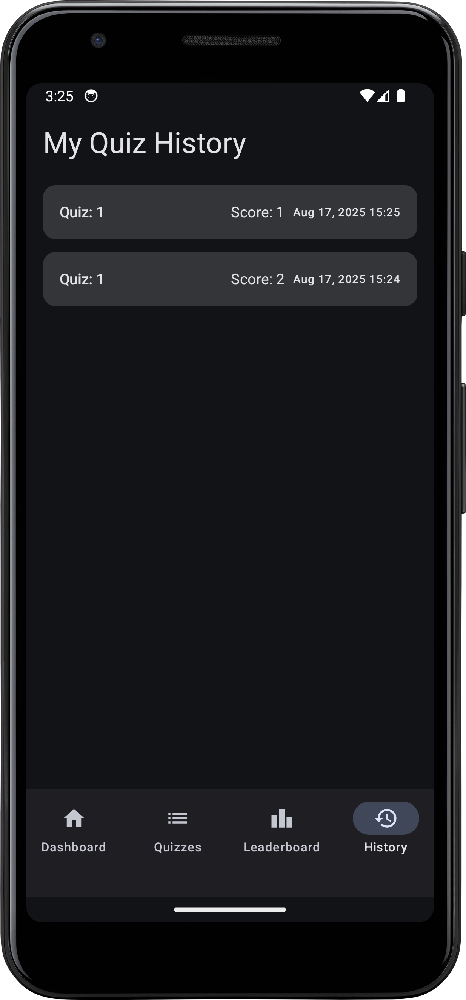
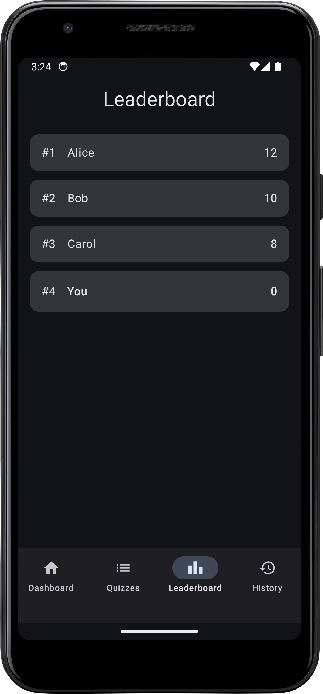

# Quiz Android App

A modern, feature-rich Quiz Android application developed while video coding with Firebender. This app allows users to take quizzes, view their quiz history, check leaderboards, and more. Built with best practices in mind, it is designed for scalability, maintainability, and a great user experience.

## Table of Contents
- [Features](#features)
- [Screenshots](#screenshots)
- [Installation](#installation)
- [Usage](#usage)
- [Architecture](#architecture)
- [Contributing](#contributing)
- [License](#license)
- [Acknowledgements](#acknowledgements)

## Features
- Take interactive quizzes
- View quiz history
- Leaderboard for top performers
- Dashboard overview
- Detailed quiz results
- Modern UI/UX

## Screenshots

| Dashboard | Quizzes | Quiz | Result |
|-----------|---------|------|--------|
|  |  |  |  |

| Quiz History | Leaderboard |
|--------------|------------|
|  |  |

## Installation

1. **Clone the repository:**
   ```bash
   git clone https://github.com/yourusername/quiz-android-app.git
   cd quiz-android-app
   ```
2. **Open in Android Studio:**
   - Open Android Studio
   - Select `Open an existing project` and choose this directory
3. **Build the project:**
   - Let Gradle sync and build the project automatically
4. **Run the app:**
   - Connect an Android device or use an emulator
   - Click the Run button or use `Shift + F10`

## Usage
- Launch the app on your device/emulator
- Sign up or log in (if authentication is implemented)
- Start taking quizzes, view your history, and check the leaderboard

## Architecture
- **Language:** Kotlin
- **Project Structure:** MVVM (Model-View-ViewModel)
- **Build System:** Gradle
- **UI:** Material Design Components
- **Persistence:** Room Database (if used)
- **Networking:** Retrofit/OkHttp (if used)

## Contributing
Contributions are welcome! Please open issues and submit pull requests for improvements or bug fixes.
1. Install [Firebender](https://plugins.jetbrains.com/plugin/25224-firebender) in your Android Studio IDE.
2. Fork the repository
3. Create your feature branch (`git checkout -b feature/YourFeature`)
4. Commit your changes (`git commit -am 'Add some feature'`)
5. Push to the branch (`git push origin feature/YourFeature`)
6. Open a pull request

## License
This project is licensed under the MIT License. See the [LICENSE](LICENSE) file for details.

## Acknowledgements
- [Firebender](https://firebender.com) for video coding inspiration
- Android Developers documentation
- Open source libraries and contributors

